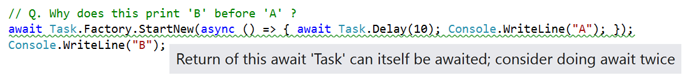
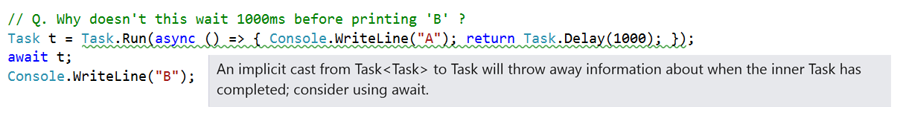

Missing Await Analyzer
========================

> * Download Analyzer NuGet: [MissingAwaitAnalyzer](https://www.nuget.org/packages/MissingAwaitAnalyzer)

```cs
await Task.Factory.StartNew(async () =>
{
    await Task.Delay(10);
    Console.WriteLine("A");
});
Console.WriteLine("B");
```

We awaited the task, with the intent that this code print `A` first and then `B`. But it doesn't. It actually prints `B` first.

*Can you see why?*

```cs
Task t = Task.Run(async () => { Console.WriteLine("A"); return Task.Delay(1000); });
await t;
Console.WriteLine("B");
```

We awaited `t` with the intent that this code print `B` after waiting 1000ms. But it printed `B` instantly.

*Can you see why?*

If you can answer 'yes' to both questions then congratulations -- you're an async expert!
If you can't then you should download this analyzer! It introduces two new warnings:






## What it does

This analyzer detects any statements of the form `await expr;` where the returned
value is itself a `Task`. In those cases it suggests that maybe you want to do `await await expr`.

> Note: in this particular case, a better suggestion would have been to use `Task.Run` instead of `Task.New`.

It also detects any implicit conversions from `Task<Task>` to `Task>`
and suggests that you do this conversion either with an `await` (which is probably what you wanted)
or an explicit cast.

